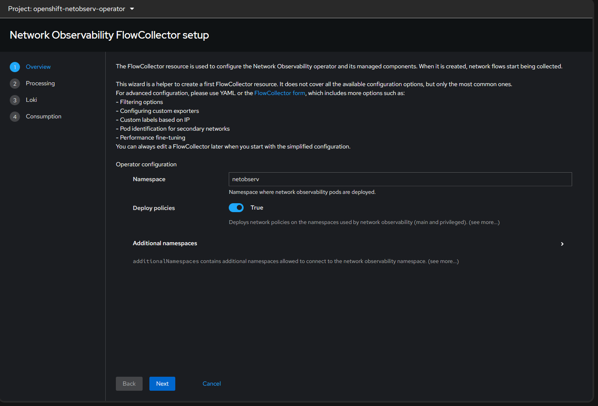
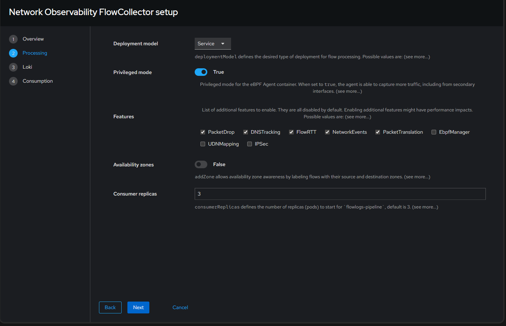
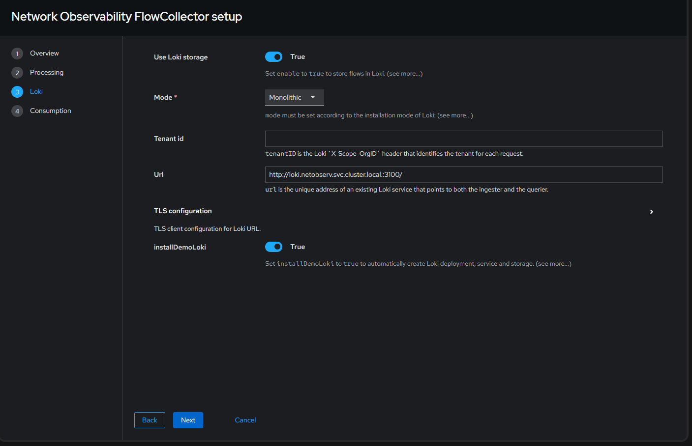
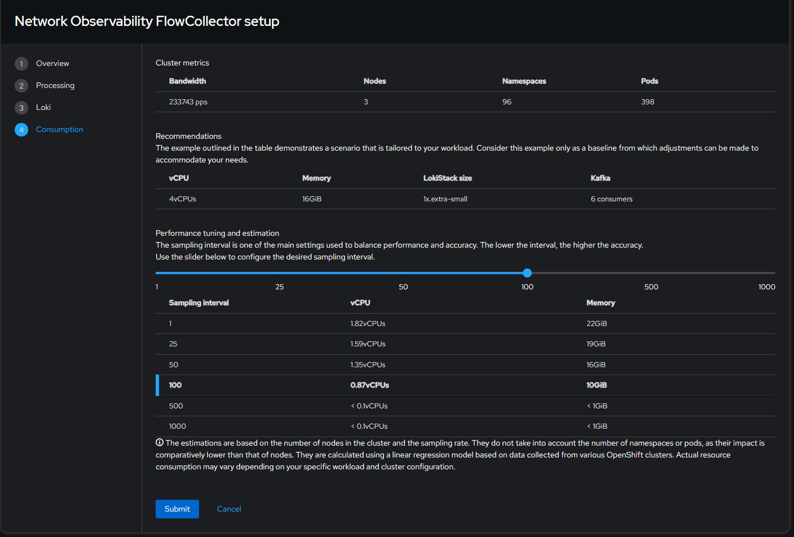
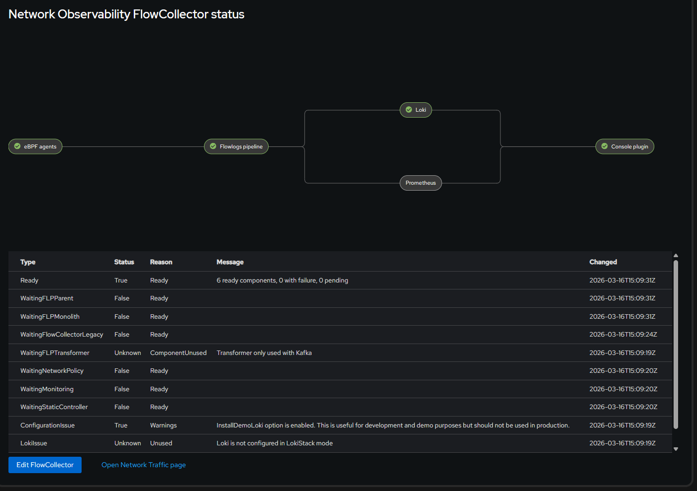
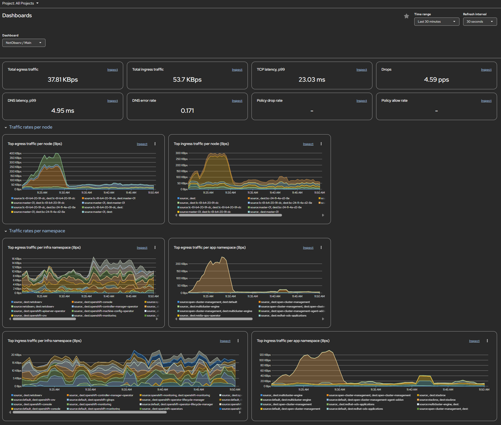
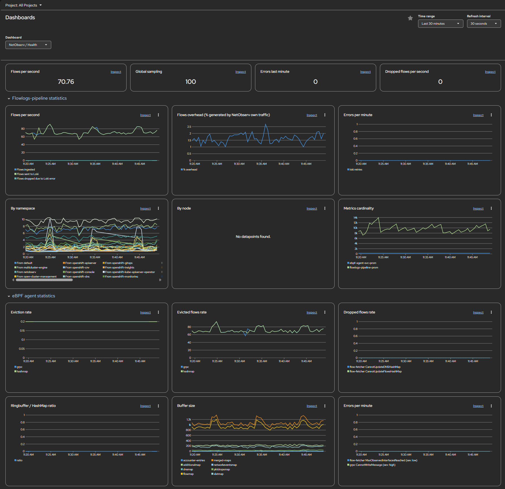
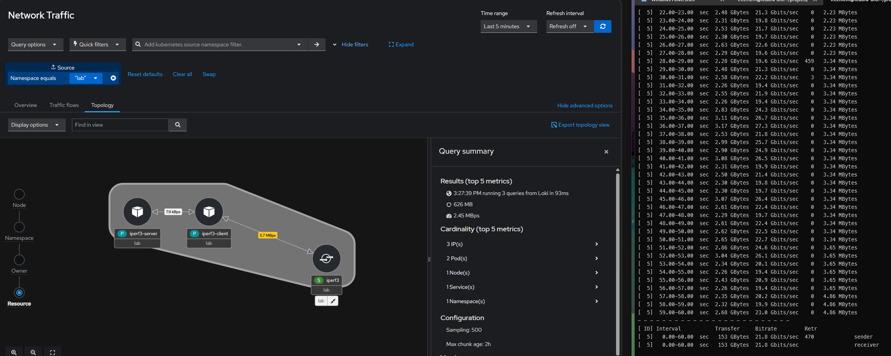

# Network Observability FlowCollector Walkthrough

Follow a Network Observability `FlowCollector` from console setup to running status, with the matching manifest included for reference.

This setup is well suited to a home lab or kicking the tires in lower environments because it uses Loki in `Monolithic` mode with `installDemoLoki` enabled.

To try this out, you'll need a Kubernetes cluster, preferably an OpenShift cluster, and the `oc` or `kubectl` command-line tool on your computer. Follow the operator [installation instructions before using this walkthrough](https://docs.redhat.com/en/documentation/openshift_container_platform/4.21/html/network_observability/installing-network-observability-operators):

Background Article: [What's new in network observability 1.11](https://developers.redhat.com/articles/2026/03/06/whats-new-network-observability-111)

## Overview

The sample uses these main settings:

- `namespace: netobserv`
- `agent.type: eBPF`
- `deploymentModel: Service`
- eBPF features: `PacketDrop`, `DNSTracking`, `NetworkEvents`, `PacketTranslation`, `FlowRTT`
- Loki enabled in `Monolithic` mode with `installDemoLoki: true`
- `processor.consumerReplicas: 3`
- console plugin enabled

## FlowCollector Wizard Walkthrough

### 1. Overview

The first screen sets the operator namespace and enables network policies. In the manifest this maps primarily to:

- `spec.namespace: netobserv`
- `spec.networkPolicy.enable: true`

### 2. Processing

The processing step shows the service deployment model, privileged eBPF agent, selected optional features, and three consumer replicas. In the manifest this corresponds to:

- `spec.deploymentModel: Service`
- `spec.agent.ebpf.privileged: true`
- `spec.agent.ebpf.features`
- `spec.processor.consumerReplicas: 3`

### 3. Loki

This setup enables Loki storage in monolithic mode and deploys the demo Loki instance automatically. The matching manifest section is:

- `spec.loki.enable: true`
- `spec.loki.mode: Monolithic`
- `spec.loki.monolithic.installDemoLoki: true`
- `spec.loki.monolithic.url: http://loki.netobserv.svc.cluster.local.:3100/`

The wizard leaves tenant ID blank, while the live manifest carries `tenantID: netobserv` in its Loki sub-sections.

### 4. Consumption

The final wizard page estimates cluster load and resource consumption. The live manifest keeps the sampling values shown in the collector configuration:

- `spec.agent.ebpf.sampling: 500`
- `spec.agent.ipfix.sampling: 400`

The screenshot highlights a sizing recommendation at sampling interval `100`, which is useful as a planning reference even though the saved manifest keeps a higher eBPF sampling value.

## Resulting Status

After submission, the FlowCollector status page shows the expected component path:

`eBPF agents -> Flowlogs pipeline -> Loki/Prometheus -> Console plugin`

The captured status is healthy overall:

- `Ready=True`
- `6 ready components, 0 with failure, 0 pending`

One warning is expected in this demo-style setup:

- `ConfigurationIssue=True` because `installDemoLoki` is enabled

That warning is consistent with the manifest and is appropriate for development or demonstration environments, not production.

## Observe Dashboards

Once the FlowCollector is ready, the OpenShift Observe dashboards provide a quick way to confirm that traffic is flowing and the pipeline is healthy.

### NetObserv / Main

The main dashboard highlights what the cluster is doing right now, including:

- total ingress and egress traffic
- TCP and DNS latency
- drop rate
- top traffic by node and namespace

This is the best first stop when you want to confirm that flows are being collected and to see which workloads are driving traffic.

### NetObserv / Health

The health dashboard focuses on the collector and pipeline itself, including:

- flows per second
- global sampling
- dropped flows and errors
- flowlogs-pipeline statistics
- eBPF agent statistics such as evictions, buffer size, and overhead

This view is useful when you want to validate that the deployment is behaving normally.

## Throughput Caveat

Network Observability is strong at flow visibility, topology, and troubleshooting, but it should not be treated as the source of truth for precise real-time bandwidth benchmarking.

In the example below, the topology view is shown beside an `iperf3` run. The numbers do not line up exactly, and that is expected:

- NetObserv is built from sampled, aggregated flow telemetry rather than packet-by-packet benchmarking
- higher sampling values, such as `spec.agent.ebpf.sampling: 500`, reduce fidelity for short or high-bandwidth tests
- topology labels such as `Latest rate`, `Average rate`, `Max rate`, and `Total` answer different questions and should not be compared interchangeably
- service and resource abstractions can change which edge appears in the graph

Use NetObserv to confirm who talked to whom, inspect the path, and estimate relative rates or transferred volume. Use a tool such as `iperf3` when you need exact throughput numbers.

